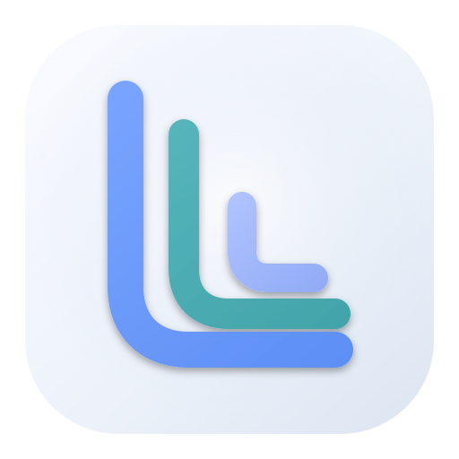

  
  <h1>Lore Client</h1>
  
<strong>专为 <a href="https://github.com/EpicGames/lore">Epic Games Lore</a> 打造的可视化桌面工作区。</strong>

  
在一个专注的工作区中浏览修订、准备更改，并管理大型游戏工程与二进制资产。

  

    
    
    
    
    
  

  
<a href="../../README.md">English</a> · 简体中文

---

## 你可以完成什么

### 浏览项目历史

Revision History 默认使用平铺模式，只聚焦当前分支的修订、该分支的本地与远端指针，以及精确的工作区 HEAD；切换到多道拓扑图谱后可跟踪合并工作线，并检查修订消息、作者、标签、完整性状态、变更文件和完整文件树。拓扑历史可按起始修订、分支、日期或分支血缘筛选；你还可以统一调整 Diff 上下文与空白策略，并独立收起或恢复 Revision Diff 面板。轨道表现形式会在重启后保留。

---

### 准备并提交更改

使用平铺列表或目录树查看本地更改，通过熟悉的桌面快捷键选择文件和目录，执行暂存或取消暂存，检查文件 Diff，独立收起或恢复右侧 Diff 面板，并使用预期的身份和消息创建新修订。文件右键菜单还可以查看和操作提示型协作锁，并从仓库工具统一管理当前分支的锁。

你可以在客户端设置中配置多个外部 Diff 与外部 Merge 工具。内置预设会从系统 `PATH` 解析命令名，自定义工具可以填写显式可执行文件路径和参数模板；只有实际可用的工具才会出现在文件菜单中。本地更改与 Revision 变更支持双文件外部比较，冲突文件支持四路外部合并；工作区不存在的 BASE、LOCAL 与 REMOTE 版本会使用受控临时文件。

---

### 管理分支、标签与冲突

分别管理本地、远端和已归档分支，并随时确认当前检出位置。你可以创建和切换分支、合并工作线、拣选或撤销修订、比较分支，以及创建和管理标签。引导式冲突会话支持解决、重新开始或中止合并、拣选和撤销操作。

---

### 处理大型与组合仓库

- 编辑并应用选择性 View，只保留当前工作区需要的文件。
- 双向查看精确文件依赖图，使用鼠标左键自由平移、滚轮围绕指针缩放，检查带标签的连线与循环，并通过带状态引导的范围参数配置依赖驱动克隆或同步。
- 克隆精确修订或分支、创建 Bare 工作区、在兼容性诊断时启用直接文件 I/O，并通过可选的修订匹配元数据键组合初始 Layer。
- 查看和管理 Layer 与链接仓库。
- 在应用内预览图片、PDF 页面、CSV 文件、TGA/TIFF 纹理和常见三维资产。

---

### 在一个入口管理仓库

打开或初始化本地仓库，浏览 Lore 服务器，在克隆前查看远端详情，发布已有工作，同步和推送分支，并在统一活动视图中跟踪操作进度。发布时可以选择任一已登录账户，也可以在允许匿名创建的服务器上明确不使用账户。设备级账户中心可以管理多个 Lore 身份、把不同账户分配给不同本地仓库，并确保 JWT 只留在 Lore 凭据存储中；受保护的服务器目录缺少凭据时会打开浏览器认证并在成功后自动重试。

---

### 使用会记住偏好的桌面工作区

通过标签同时打开多个仓库，调整并恢复工作区布局，切换深色或浅色主题，并使用支持键盘操作的菜单和导航。界面支持英文与简体中文。

遇到问题时，有界的应用日志会在平台固定日志目录中记录命令耗时与错误；可从“客户端设置 → 维护”直接打开该目录。

---

## 开始使用

1. 从当前仓库的 Releases 页面下载 Windows x64、Linux x64 或 macOS Universal 安装包。
2. 启动 Lore Client，打开已有 Lore 仓库、初始化普通目录，或连接 Lore 服务器并克隆仓库。
3. 从“修订历史”理解项目，在“本地更改”准备下一次修订，并在“分支总览”管理不同工作线。

Lore 已随桌面应用提供，无需单独安装 Lore CLI。服务器浏览、克隆、发布、推送及其他在线功能需要可访问的 Lore 服务。

---

## 预览状态

Lore Client 仍在持续开发中。用于生产仓库前，请先验证重要工作流。当前冲突处理支持 Lore 提供的引导式解决操作，但不包含内嵌三方文本合并编辑器。

---

## 文档

- [使用手册](manual/README.md)
- [开发者指南](DEVELOPMENT.md)
- [English user guide](../../README.md)
- [English user manual](../en/manual/README.md)
- [English developer guide](../en/DEVELOPMENT.md)
